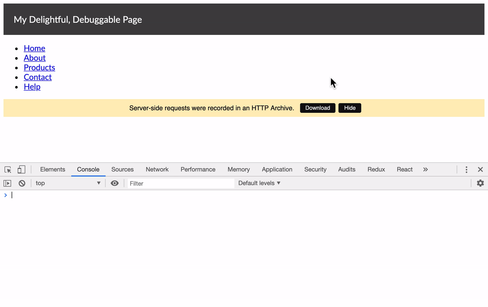

# next-fetch-har

```console
$ yarn add next-fetch-har
```

## Motivation

When you click from page to page in a Next.js app, it’s easy to see and debug
what API calls your `getInitialProps` methods are making: just look in your
browser’s Network tab.

But what about during Server Side Rendering (SSR)? In my experience, one of the
harder aspects of debugging Next.js apps is getting visibility into what
`getInitialProps` is doing on the server — particularly what API requests and
responses the app is seeing.

Even if you connect to the [Node.js Inspector](https://nodejs.org/en/docs/guides/debugging-getting-started/),
it has no equivalent to the browser’s Network tab. So what if you had some
other way to populate the Network tab with the network activity from the server,
as if those requests were made in the browser?

That’s what [node-fetch-har](https://github.com/exogen/node-fetch-har) and this
library allow you to do!

## Usage

### Step 1: Wrap your &lt;App&gt;

This library exports a `withFetchHar` Higher Order Component (HOC) that you can
wrap your `<App>` component with to enable recording of server-side Fetch API
calls.

In `_app.js`:

```js
import App from "next/app";

export default withFetchHar(App);
```

If you have not exposed a global `fetch` polyfill on the server, you can supply
your `fetch` instance to the HOC:

```js
import fetch from "isomorphic-unfetch";

export default withFetchHar(App, { fetch });
```

### Step 2: Use the enhanced Fetch

Instead of using a global Fetch instance, the `withFetchHar` HOC creates a
per-request instance of Fetch that logs requests as HAR entries. It adds this
Fetch instance to the `ctx` object that your pages receive in `getInitialProps`.
You should switch your calls to use this instance of Fetch.

```js
static HomePage extends React.Component {
  static async getInitialProps(ctx) {
    // Get `fetch` from `ctx`.
    const { fetch } = ctx;

    // Example of what you might do with your API...
    const response = await fetch('/api/foo');
    const body = await response.json();

    return { value: body.foo };
  }

  render() {
    // Do something with value...
  }
}
```

### Step 3: Download the HTTP Archive

When `getInitialProps` is complete, the `withFetchHar` HOC adds the resulting
HTTP Archive (HAR) to the app’s `getInitialProps` output, and renders a download
button at the bottom of the page to access it.



## Troubleshooting

#### Some browser APIs like Headers, URLSearchParams, etc. are not found!

[node-fetch-har](https://github.com/exogen/node-fetch-har) may require access to
some of the browser APIs that Fetch uses. While [node-fetch](https://github.com/bitinn/node-fetch)
does export these, they aren’t necessarily globally available; some libraries
like [isomorphic-fetch](https://github.com/matthew-andrews/isomorphic-fetch) set
them on the `global` object for you.

You have two options:

- Make them available on `global` yourself or using a library.
- Pass them as options to `withFetchHar`, for example:

  ```js
  import App from "next/app";
  import { Response } from "node-fetch";

  export default withFetchHar(App, { Response });
  ```

#### What if I don’t call fetch directly in my getInitialProps?

You’ll need to find some way to pass the `ctx.fetch` instance through to your
code that needs to call it. For example, if you make API calls inside Redux
actions using a side-effect solution like [redux-thunk](https://github.com/reduxjs/redux-thunk),
you can pass `ctx.fetch` to your store creation function so that it can
be supplied to any side-effect middleware.

For redux-thunk in particular, you can use its [withExtraArgument](https://github.com/reduxjs/redux-thunk#injecting-a-custom-argument)
feature to pass a custom object containing `fetch` and whatever else you like:

```js
function actionCreator() {
  return async (dispatch, getState, context) => {
    const response = await context.fetch("/api/foo");
  };
}
```

For scenarios where your store may sometimes have been created by `getInitialProps`
and other times not, you can always fall back to vanilla Fetch, since we can
only capture activity during `getInitialProps` anyway:

```js
const store = createStore(
  reducer,
  applyMiddleware(
    thunk.withExtraArgument({
      fetch: ctx ? ctx.fetch : global.fetch
    })
  )
);
```
